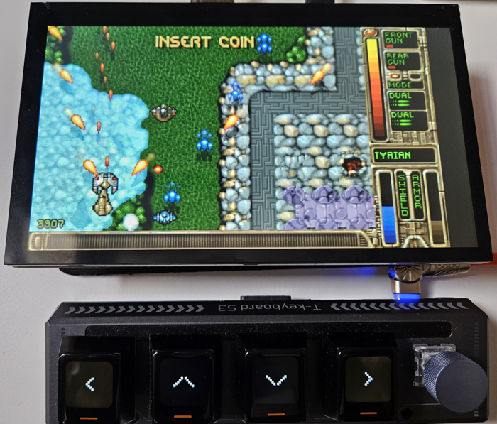

# OpenTyrian - ESP32 Port



OpenTyrian with ESP32-P4 and [T-Keyboard S3 Pro](https://github.com/MatheyDeo/LilyGoT-keyboard-s3-pro-usb-boot-keyboard).

This is a port of OpenTyrian to the ESP32 platform, originally ported to ESP32 by Gadget Workbench and updated for new hardware with support for [Board Support Packages](https://components.espressif.com/components?q=Board+Support+Package).

The fork was updated to use all the game data directly from flash, as SD cards have a tendency to be unreliable. It now works with ESP-IDF and utilizes the latest [SDL3](https://components.espressif.com/components/georgik/sdl) available at the Espressif Component Registry.

## Storyline

OpenTyrian is an open-source port of the DOS game Tyrian.

Tyrian is an arcade-style vertical scrolling shooter. The story is set in 20,031 where you play as Trent Hawkins, a skilled fighter-pilot employed to fight MicroSol and save the galaxy.

## Requirements

- ESP-IDF 5.5 or later
- [ESP32-S3-BOX-3](https://components.espressif.com/components/espressif/esp-box-3)
- [ESP32-P4](https://components.espressif.com/components/espressif/esp32_p4_function_ev_board_noglib)
- [M5Stack-CoreS3](https://components.espressif.com/components/espressif/m5stack_core_s3)

## ESP32-P4 Features

The ESP32-P4 version leverages the **Pixel Processing Accelerator (PPA)** for enhanced graphics performance. The PPA is a hardware accelerator specifically designed for image and graphics processing operations, enabling smooth scaling of the original game graphics to full display resolution with minimal CPU overhead.

The [PPA peripheral](https://docs.espressif.com/projects/esp-idf/en/stable/esp32p4/api-reference/peripherals/ppa.html) provides hardware acceleration for:
- Image scaling and rotation
- Color format conversion
- Blending operations
- Real-time graphics transformations

This hardware acceleration ensures OpenTyrian runs smoothly at full display resolution while maintaining responsive gameplay.

## Web-based Flashing (Easiest)

For the quickest installation, use our web-based installer (Chrome/Edge browsers recommended):

[](https://georgik.github.io/OpenTyrian/)

1. Connect your ESP32-P4 board via USB
2. Click the button above to open the web installer
3. Click "Connect" and select your board's serial port
4. Choose "OpenTyrian" and your board type
5. Click "Flash" and wait for completion

## Manual Installation

You can use the `@board/` parameter with `idf.py` to switch between different board configurations.

Configure the build environment for your board:

For ESP32-S3-BOX-3:
```shell
idf.py @boards/esp-box-3.cfg build
```

For ESP32-P4:
```shell
idf.py @boards/esp32_p4_function_ev_board.cfg build
```

For M5Stack-CoreS3:
```shell
idf.py @boards/m5stack_core_s3.cfg build
```

### Build and flash the firmware:

```shell
idf.py @boards/... flash monitor
```

### Flash only application

Once you have bootloader in place, you can flash only application to save the time.

```shell
idf.py @boards/... app-flash monitor
```

## Firmware for the Keyboard

If you'd like to extend the project by using [T-Keyboard S3 Pro](https://lilygo.cc/products/t-keyboard-s3-pro), then you can use project [LilyGoT-keyboard-s3-pro-usb-boot-keyboard](https://github.com/MatheyDeo/LilyGoT-keyboard-s3-pro-usb-boot-keyboard).

## Acknowledgements

This port is based on the work of the original OpenTyrian project (https://github.com/jkirsons/OpenTyrian) and an ESP32 port by Gadget Workbench, which was initially created for ESP-WROVER and ESP-IDF 4.2. The current version is compatible with ESP-IDF 5.3 and leverages the ESP-BSP for board support. The updated port uses SDL3, available on the [Espressif Component Registry](https://components.espressif.com/components/georgik/sdl/).

## Original Video

[](https://www.youtube.com/watch?v=UL5eTUv7SZE)

## Credits

Special thanks to all contributors and the open-source community for making this project possible.

